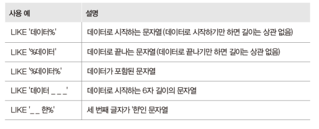

# 6장 데이터베이스 언어 SQL (2)

## 데이터 검색:SELECT문
* 대소문자를 구분하지 않는다. 그러나 구분하여 적어주면 검색속도를 높여 더 높은 성능은 꾀할 수 있다.
* 명령문을 이어쓸 수 있을나, 들여쓰기로 구분해서 작성하는 것이 가독성을 높일 수 있다.

#### 예제16
제품 테이블에서 제품명과 단가를 검색하되, 단가를 가격이라는 새 이름으로 출력해보자.
```sql
SELECT 제품명, 가격 AS 단가
FROM 제품
```
(ppt에는 제품테이블에 단가라고 되어 있지만 가격이라고 표기되야함. ppt오류)

#### 예제17
제품 테이블에서 제품명과 단가 속성을 검색하되, 단가에 500원을 더해 '조정 단가'라는 새 이름으로 출력해보자.
```sql
SELECT 제품명, 단가+500 AS “조정 단가”
FROM 제품;
```
### 조건 검색

[ WHERE 조건]으로 SELECT문 뒤에 적는다.

숫자형 상수 값은 그대로 사용하지만, 문자와 날짜형의 상수 값은 작은 따옴표로 묶어서 표현함.

날짜값에는 고유현 숫자값이 할당되어 있기 때문에 비교연산이 가능하다.

논리연산자.

AND:모든 조건을 만족해야 검색함.

OR: 여러 조건 중 한 가지만 만족해도 검색함.

NOT: 조건을 만족하지 않는 것만 검색함.

#### 예제18
제품 테이블에서 한빛제과가 제조한 제품의 제품명, 재고량, 단가를 검색함.

```sql
SELECT 제품명, 재고량, 단가
FROM 제품
WHERE 제조업체=’한빛제과’
```
#### 예제19
주문 테이블에서 apple고객이 15개 이상 주문한 주문제품, 수량, 주문일자를 검색함.
```sql
SELECT 주문제품, 수량, 주문일자
FROM 주문
WHERE 주문고객 = ‘apple’ AND 수량≥15;
```
#### 예제20
주문 테이블에서 apple고객이 주문했거나 15개 이상 주문된 제품의 주문제품, 수량, 주문일자, 주문일자, 주문고객을 검색.
```sql
SELECT 주문제품, 수량, 주문일자, 주문고객
FROM 주문
WHERE 주문고객 = 'apple' OR 수량>=15; 
```
#### 예제21
제품 테이블에서 단가가 2000원 이상이면서 3000원 이하인 제품의 제품명, 단가, 제조업체를 검색
```sql
SELECT 제품명, 단가, 제조업체
FROM 제품
WHERE 단가>=2000 AND 단가<=3000;
```

### LIKE를 이용한 검색

문자열에서 부분적으로 일치하는 데이터를 검색함.

% >> 0개 이상의 문자

_  >> 1개의 문자



#### 예제22

고객 테이블에서 성이 김 씨인 고객의 고객이름, 나이, 등급, 적립금을 검색

```sql
SELECT 고객이름, 나이, 등급, 적립금
FROM 고객
WHERE 고객이름 LIKE '김%';
```

#### 예제23

고객 테이블에서 고객아이디가 5자인 고객의 고객아이디, 고객이름, 등급을 검색

```sql
SELECT 고객아이디, 고객이름, 등급
FROM 고객
WHERE 고객아이디 LIKE '_____';
```

#### NULL을 이용한 검색

IS NULL 연산자는 열 값 중에서 NULL값을 포함하는 행을 검색함.

IS NOT NULL 연산자는 NULL이 아닌 행을 검색함.

#### 예제24
고객 테이블에서 나이가 아직 입력되지 않은 고객의 고객이름을 검색.

```sql
SELECT 고객이름
FROM 고객
WHERE 나이 IS NULL;
```

#### 예제25
고객 테이블에서 나이가 이미 입력된 고객의 고객이름을 검색해보자.
```sql
SELECT 고객이름
FROM 고객
WHERE 나이 IS NOT NULL
```

#### 추가 예제1
고객 테이블에서 주소가 입려고디지 않은 고객의 고객아이디, 이름을 검색하시오.

```sql
SELECT 고객아이디, 이름
FROM 고객
WHERE 주소=NULL;
```

>> 값이 나오지 않음. (error)

tip: NULL인지 비교하기 위해 속성이름=NULL을 사용하면 안됨.

```sql
SELECT 고객아이디, 이름
FROM 고객
WHERE 주소 IS NULL;
```

이렇게 써야 됨.

#### 추가 예제2

고객 테이블에서 주소가 입력된 고객의 이름과 주소를 검색하시오.

```sql
SELECT 이름, 주소
FROM 고객
WHERE 주소<>NULL;
```

>> error!(NULL이 아닌 조건은 <>NULL을 사용하면 안됨.)

tip

1. CHAR 데이터 타입의 값을 ‘’와 같이 데이터를 전혀 입력하지 않은 것과 NULL은 다름
2. INT의 0값은 NULL과 다름
3. 문자열 값이 입력되지 않은 속성은 NULL값을 주는 것이 좋음
4. INT값을 입력하지 않을 경우 DEFAULT를 사용하여 0으로 초기화하는 것이 좋음.

>>

```sql
SELECT 이름, 주소
FROM 고객
WHERE 주소 IS NOT NULL;
```

만약 속성값이 빈 문자열인 경우 질의문은?

```sql
SELECT 이름, 주소
FROM 고객
WHERE 주소='';
```

#### 추가 예제3

제품 테이블에서 가격을 입력하지 않은 제품번호, 품명을 검색하시오.

```sql
SELECT 제품번호, 품명
FROM 제품
WHERE 가격 IS NULL;
```

#### 추가 예제4

제품 테이블에서 가격이 0원인 제품번호, 품명을 검색하시오.

```sql
SELECT 제품번호, 품명
FROM 제품
WHERE 가격=0;
```

#### 추가 예제5

제품 테이블에서 가격이 2000원 미만인 제품번호, 품명, 가격을 검색하시오.

```sql
SELECT 제품번호, 품명, 가격
FROM 제품
WHERE 가격<2000;
```


