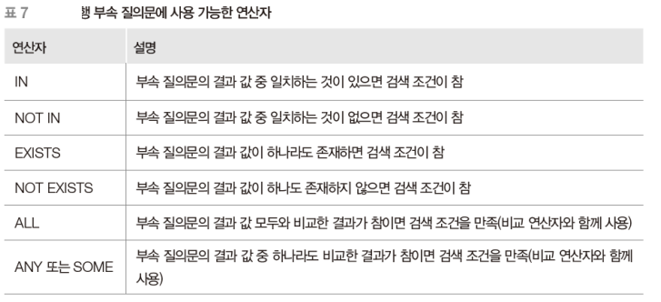

# 6장 데이터베이스 언어 SQL (3)
## SQL을 이용한 데이터 조작
### 데이터 검색: SELECT 문
#### 여러 테이블에 대한 조인 검색
##### 예제 38
판매 데이터베이스에서 나이가 30세 이상인 고객이 주문한 제품의 주문제품과 주문일자를 검색해보자.
```sql
SELECT 주문.주문제품, 주문.주문일자
FROM 고객, 주문
WHERE 고객.나이>=30 AND 고객.고객아이디=주문.주문고객;
```
--|주문제품|주문일자
--|--|--
1|p01|2019-030

#### 여러 테이브렝 대한 조인 검색
* 이름이 같은 속성이 있다면, SELECT문에서 테이블의 출처를 밝히지 않고 속석명만 적어도 된다.
* FROM에서 테이블을 FROM 테이블 a 형태로 선언하면 속성명을 적을 때, a.속성명으로 대체할 수 있다.

##### 예제 39
판매 데이터베이스에서 고명석 고객이 주문한 제품의 제품명을 검색해보자.
```sql
SELECT 제품.제품명
FROM 고객, 제품, 주문
WHERE 고객.고객이름 ='고명석' AND 고객.고객아이디 = 주문.주문고객 AND 제품.제품번호=주문.주문제품;
```

#### 부속 질의문을 이용한 검색
* SELECT 문 안에 또 다른 SELECT 문을 포함하는 질의
  * 상위 질의문(주 질의문): 다른 SELECT 문을 포함하는 SELECT 문
  * 부속 질의문(서브 질의문): 다른 SELECT 문 안에 들어 있는 SELECT 문
    * 괄호로 묶어서 작성, ORDER BY 절을 사용할 수 없음
    * 단일 행 부속 질의문: 하나의 행을 결과로 반환
    * 다중 행 부속 질의문: 하나 이상의 행을 결과로 반환
* 부속 질의문을 먼저 수행하고, 그 결과를 이용해 상위 질의문을 수행
  * 프로그래밍 언어의 2중 if문과 비슷함.
* 부속 질의문과 상위 질의문을 연결하는 연산자가 필요
  * 단일 행 부속 질의문은 비교 연산자(=, <>, >, >=, <, <=) 사용 가능
  * 다중 행 부속 질의문은 비교 연산자 사용 불가

##### 예제41
판매 데이터베이스에서 적립금이 가장 많은 고객의 고객이름과 적립금을 검색해보자.
```sql
SELECT 고객이름, 적립금
FROM 고객
WHERE 적립금=(SELECT MAX(적립금) FROM 고객;)
```
>>
```sql
SELECT 고객이름, 적립금
FROM 고객
WHERE 적립금=5000;
```
#### 부속 질의문을 이용한 검색


##### 예제45
판매 데이터베이스에서 2019년 3월 15일에 제품을 주문한 고객의 고객이름을 검색해보자.
```sql
SELECT 고객이름
FROM 고객
WHERE EXISTS(
    SELECT *
    FROM 주문
    WHERE 주문일자='2019-03-15' AND 주문고객=고객.고객아이디;
);
```
##### 추가 예제
등급이 정회원인 회원들의 평균 키보다 작은 회원들의 회원명, 등급, 주소, 키를 검색하라.
```sql
SELECT 회원명, 등급, 주소, 키
FROM 회원
WHERE 키 < (
    SELECT AVG(키)
    FROM 회원
    WHERE 등급 = '정회원' 
);
```
### 데이터 삽입: INSERT 문
#### 데이터 직접 삽입
* INTO 키워드와 함께 투플을 삽입할 테이블의 이름과 속성의 이름을 나열
  * 속성 리스트를 생략하면 테이블을 정의할 때 지정한 속성의 순서대로 값이 삽입됨
* VALUES 키워드와 함께 삽입할 속성 값들을 나열
* INTO 절의 속성 이름과 VALUES 절의 속성 값은 순서대로 일대일 대응되어야 함
* 속성의 리스트가 Table의 모든 속성을 열거하지 않았다면 열거 안된 속성의 값은
default값(일반적으로 NULL)을 갖게 됨.

##### 예제48
판매 데이터베이스의 고객 테이블에 고객아이디가 tomato, 고객이름이 정은심, 나이가 36세, 등급이 gold, 적립금이 4,000원, 직업은 아직 모르는 새로운 고객의 정보를 삽입해보자. 그런 다음 고객 테이블에 있는 모든 내용을 검색하여 삽입된 정은심 고객의 직업 속성이 널 값인지 확인해보자.
```sql
insert 
into  고객(고객아이디, 고객이름, 나이, 등급, 적립금)
values {'tomato', '정은심', 36, 'gold', 4000}
```
>> 테이블 중 직업이 빠졌기 때문에 만약, into에 속성값을 명시하시 않고, values에 직업 부분에 값을 주지 않으면, 오류가 난다. NULL이라 매칭되는 어떤 값을 넣어줘야한다.

#### 부속 질의문을 이용한 데이터 삽입
* SELECT 문을 이용해 다른 테이블에서 검색한 데이터를 삽입
  * VALUE부분을 SELECT,FROM,WHERE등으로 테이블을 찾아주면 됨.

```sql
insert 
into 한빛제품(제품명, 재고량, 단가)
select 제품명, 재고량, 단가
from 제품
where 제조업체='한빛제과';
```
>> 제품 테이블의 제조업체가 한빛제과인 튜플에서 제품명, 재고량, 단가부분만 한빛제품이라는 테이블에 제품명, 재고량, 단가에 맞게 값을 넣는다.

