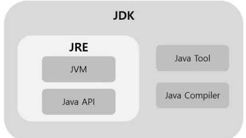

# Java
> c의 절차지향 방식의 언어의 단점을 보안하기 위해 설계된 객체지향, 고급언어이다.

## 컴파일
> 일반적으로 컴파일은 소스코드에서 라이브러리를 참조하는 linking을 거쳐 실행파일으로 되는 것을 의미한다.

## 목적 및 특징
* 플랫폼 호환성 문제 해결
  * 일반적으로 OS에 따라 실행파일을 따로 만들어 줘야하는데 자바는 이를 해결했다.
  * 따라서, 플랫폼에 독립적인 언어라고 할 수 있다.
* 메모리 사용량이 적음
  * 메모리 사용량이 적기 때문에 임베디드에서 유용하다.
* 웹, 특히 백엔드 특화
* 메모리 책임이슈를 제거
  * c,c++에서는 할당된 메모리는 직접 free시켜줘야하는데 자바에서는 자동으로 메모리를 관리해줌

### JVM
> Java Virtual Machine, 일반적인 컴파일 단계를 거치지 않고, 바이트코드까지만 컴파일을 하고, 각 운영체제에 jvm을 사용해서 바이트코드파일을 실행하는 구조를 가진다.

> 일반적으로 컴파일을 위해, 라이브러를 참조하는 링킹을 통해, 해당함수의 정보를 실행파일에 담게된다. 자바는 소스코드만 바이트코드로 변환하고, 필요한 함수정보는 jvm에서 참조만하고 담지는 않기 때문에 비교적 파일이 가볍다.

### JDK & JRE

> 간단하게, 임베디드 같은 파일의 실행만 위한 환경에서는 jre, 개발처럼 코드를 수정하고 디버그하는 과정이 필요한 곳에서는 jdk
